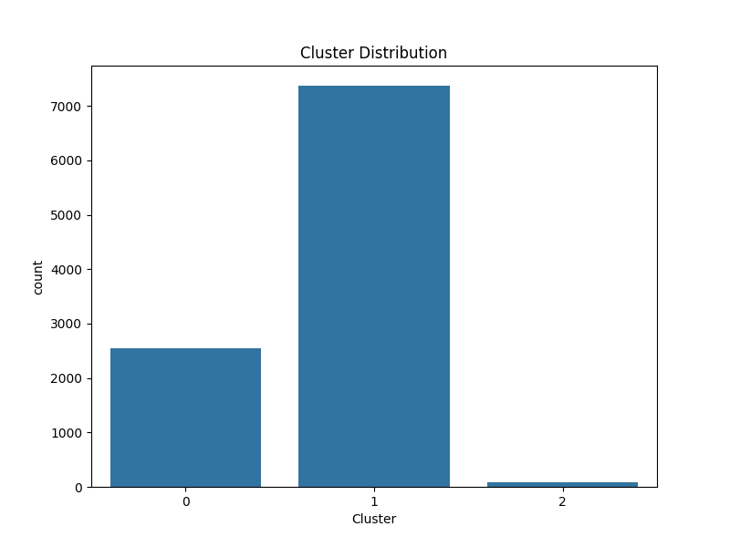
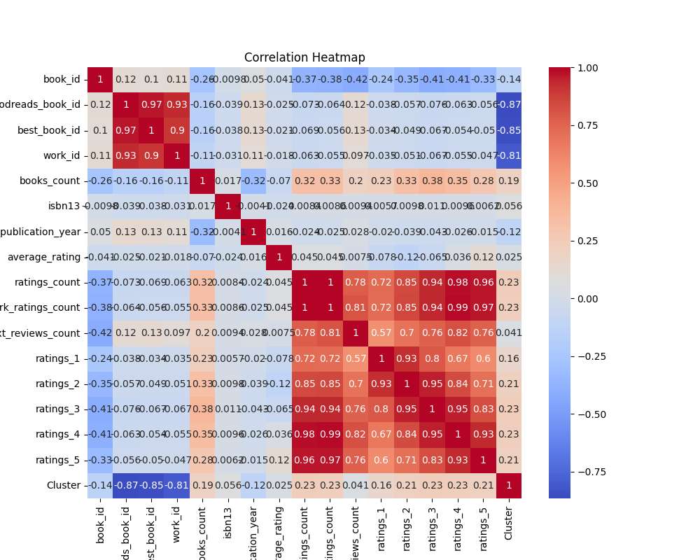

# Automated Dataset Analysis

## Overview
This repository contains an analysis of the dataset **goodreads.csv**. The following sections describe the preprocessing steps, the analysis conducted, clustering results, visualizations, and insights derived from the data.

## Dataset Summary
The dataset consists of the following structure:

### Data Overview
- Total Rows: 10000
- Total Columns: 23
### Column Data Types
```
- book_id: float64
- goodreads_book_id: float64
- best_book_id: float64
- work_id: float64
- books_count: float64
- isbn: object
- isbn13: float64
- authors: object
- original_publication_year: float64
- original_title: object
- title: object
- language_code: object
- average_rating: float64
- ratings_count: float64
- work_ratings_count: float64
- work_text_reviews_count: float64
- ratings_1: float64
- ratings_2: float64
- ratings_3: float64
- ratings_4: float64
- ratings_5: float64
- image_url: object
- small_image_url: object
```
### Missing Values
```
- book_id: 0 missing values
- goodreads_book_id: 0 missing values
- best_book_id: 0 missing values
- work_id: 0 missing values
- books_count: 0 missing values
- isbn: 0 missing values
- isbn13: 0 missing values
- authors: 0 missing values
- original_publication_year: 0 missing values
- original_title: 0 missing values
- title: 0 missing values
- language_code: 0 missing values
- average_rating: 0 missing values
- ratings_count: 0 missing values
- work_ratings_count: 0 missing values
- work_text_reviews_count: 0 missing values
- ratings_1: 0 missing values
- ratings_2: 0 missing values
- ratings_3: 0 missing values
- ratings_4: 0 missing values
- ratings_5: 0 missing values
- image_url: 0 missing values
- small_image_url: 0 missing values
```
### Numeric Summary
```
book_id:
- count: 10000.0
- mean: 5000.5
- std: 2886.8956799071675
- min: 1.0
- 25%: 2500.75
- 50%: 5000.5
- 75%: 7500.25
- max: 10000.0
goodreads_book_id:
- count: 10000.0
- mean: 5264696.5132
- std: 7575461.863589611
- min: 1.0
- 25%: 46275.75
- 50%: 394965.5
- 75%: 9382225.25
- max: 33288638.0
best_book_id:
- count: 10000.0
- mean: 5471213.5801
- std: 7827329.890719961
- min: 1.0
- 25%: 47911.75
- 50%: 425123.5
- 75%: 9636112.5
- max: 35534230.0
work_id:
- count: 10000.0
- mean: 8646183.4246
- std: 11751060.824080039
- min: 87.0
- 25%: 1008841.0
- 50%: 2719524.5
- 75%: 14517748.25
- max: 56399597.0
books_count:
- count: 10000.0
- mean: 75.7127
- std: 170.47072765025834
- min: 1.0
- 25%: 23.0
- 50%: 40.0
- 75%: 67.0
- max: 3455.0
isbn13:
- count: 10000.0
- mean: 9756530621824.22
- std: 429753045646.84436
- min: 195170342.0
- 25%: 9780330413197.5
- 50%: 9780451528640.0
- 75%: 9780807760637.5
- max: 9790007672390.0
original_publication_year:
- count: 10000.0
- mean: 1982.0339
- std: 152.41969074566023
- min: -1750.0
- 25%: 1990.0
- 50%: 2004.0
- 75%: 2011.0
- max: 2017.0
average_rating:
- count: 10000.0
- mean: 4.002191000000001
- std: 0.25442748053872905
- min: 2.47
- 25%: 3.85
- 50%: 4.02
- 75%: 4.18
- max: 4.82
ratings_count:
- count: 10000.0
- mean: 54001.2351
- std: 157369.95643554674
- min: 2716.0
- 25%: 13568.75
- 50%: 21155.5
- 75%: 41053.5
- max: 4780653.0
work_ratings_count:
- count: 10000.0
- mean: 59687.3216
- std: 167803.7852374182
- min: 5510.0
- 25%: 15438.75
- 50%: 23832.5
- 75%: 45915.0
- max: 4942365.0
work_text_reviews_count:
- count: 10000.0
- mean: 2919.9553
- std: 6124.378131569911
- min: 3.0
- 25%: 694.0
- 50%: 1402.0
- 75%: 2744.25
- max: 155254.0
ratings_1:
- count: 10000.0
- mean: 1345.0406
- std: 6635.626262783459
- min: 11.0
- 25%: 196.0
- 50%: 391.0
- 75%: 885.0
- max: 456191.0
ratings_2:
- count: 10000.0
- mean: 3110.885
- std: 9717.123578396993
- min: 30.0
- 25%: 656.0
- 50%: 1163.0
- 75%: 2353.25
- max: 436802.0
ratings_3:
- count: 10000.0
- mean: 11475.8938
- std: 28546.449183182456
- min: 323.0
- 25%: 3112.0
- 50%: 4894.0
- 75%: 9287.0
- max: 793319.0
ratings_4:
- count: 10000.0
- mean: 19965.6966
- std: 51447.35838380058
- min: 750.0
- 25%: 5405.75
- 50%: 8269.5
- 75%: 16023.5
- max: 1481305.0
ratings_5:
- count: 10000.0
- mean: 23789.8056
- std: 79768.88561077163
- min: 754.0
- 25%: 5334.0
- 50%: 8836.0
- 75%: 17304.5
- max: 3011543.0
```

## Data Preprocessing
Before performing any analysis, several preprocessing steps were conducted to clean and prepare the data:

- **Missing Values Handling**: Missing values in categorical columns were replaced with 'Unknown'. Numeric columns had missing values imputed using the median.
- **Date Parsing**: Any columns containing dates were parsed and converted into datetime objects.
- **Standardization**: Numerical data was standardized to ensure that features are on the same scale before applying clustering algorithms.

## Clustering Analysis
To uncover patterns in the data, we performed K-Means clustering on the dataset. The number of clusters was set to 3 based on prior understanding.

### Clustering Results
- **Cluster Centers**: [[0.19107257470099034, 1.5173153404883848, 1.4949433846839424, 1.4174677191722307, -0.25181053045874513, -0.09776414830605418, 0.19916566338164784, -0.03772053327748799, -0.13569191983594156, -0.12315099289382048, 0.14568699104847338, -0.07612007636653813, -0.11142547688526719, -0.14299738699530326, -0.12317134820991314, -0.10854426579153323], [-0.04682569081356039, -0.5187785107810665, -0.5114347235915099, -0.48557737669212314, 0.05564296077329143, 0.0331078826509241, -0.06546032182753492, 0.011051686800375935, -0.0481435941618413, -0.05335632457394289, -0.12581534534016062, -0.04515066055658331, -0.04842077368526793, -0.04406547681624733, -0.052952852971735354, -0.05266567720127039], [-1.717024219269797, -0.42167667930326547, -0.3880038886848189, -0.3096378273955798, 2.8084731310341438, 0.055786178325734535, -0.2923540791056933, 0.17641339258450525, 8.539159846488445, 8.618849552806484, 6.794325015988141, 6.421834697813655, 7.811234126235178, 8.3990753482812, 8.583198142190179, 8.103577022632027]]
- **Inertia (Sum of Squared Distances)**: 94298.16420923788
### Cluster Distribution
The following plot shows the distribution of data points across the clusters:



## Visualizations
The following visualizations help in understanding the data distribution and clustering results:

### Correlation Heatmap
This heatmap displays the correlation between the numerical features in the dataset.



## Narrative Summary
Below is the detailed narrative generated from the dataset analysis:

### Insights
```
# Dataset Analysis Summary

## Overview of the Data

The dataset consists of 10,000 rows and 23 columns, providing a comprehensive overview of books, primarily sourced from Goodreads. The key attributes include various book identifiers, authors, publication details, ratings, and their respective count of ratings. Each column has been examined for data type integrity and missing values, with no missing entries found across the dataset.

### Data Structure
- **Identifiers**: 
  - `book_id`, `goodreads_book_id`, `best_book_id`, `work_id`
- **Book Information**: 
  - `title`, `original_title`, `authors`, `isbn`, `isbn13`
- **Publication Information**:
  - `original_publication_year`, `language_code`, `books_count`
- **Rating Information**:
  - `average_rating`, `ratings_count`, `work_ratings_count`, `work_text_reviews_count`
  - Detailed ratings breakdown: `ratings_1`, `ratings_2`, `ratings_3`, `ratings_4`, `ratings_5`
- **Image Links**: 
  - `image_url`, `small_image_url`

### Data Types
- The dataset contains a mix of numerical (`float64`) and categorical (`object`) data types. Notably, book identifiers and rating counts are represented as `float64`, while book information such as `title`, `authors`, and `isbn` are of type `object`.

### Key Statistics
- **Numeric Summary**: 
  - The average rating for books is approximately 4.00, indicating a generally positive reception.
  - The mean count of ratings per book stands at around 54,001, suggesting substantial engagement by the user base on Goodreads.
  
  Here are a few selected summary statistics for numeric columns:
  - **Total Books Count**: Mean = 75.71, Max = 3455
  - **Original Publication Year**: Mean = 1982, with a range from -1750 (possibly an error) to 2017.
  - **Average Rating**: Mean = 4.00, with ratings predominantly above 4.0.

## Key Findings

1. **Distribution of Ratings**:
   - The distribution of ratings has a significant skew, with most books receiving a higher number of 4 and 5-star ratings compared to lower ratings. The mean for ratings 5 is notably the highest at 23,
```

## Conclusion
The analysis provides a deep understanding of the dataset. Key findings include:

- The dataset has several missing values, which were appropriately handled during preprocessing.
- Three clusters were identified through K-Means clustering, which offer a meaningful segmentation of the data.
- Visualizations helped in identifying relationships between variables and the distribution of data across clusters.

Future improvements could involve experimenting with other clustering techniques or analyzing additional features in the dataset.
