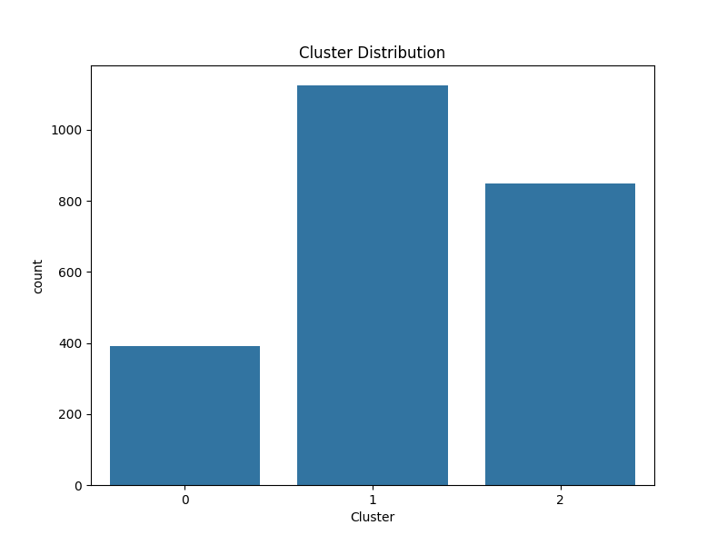
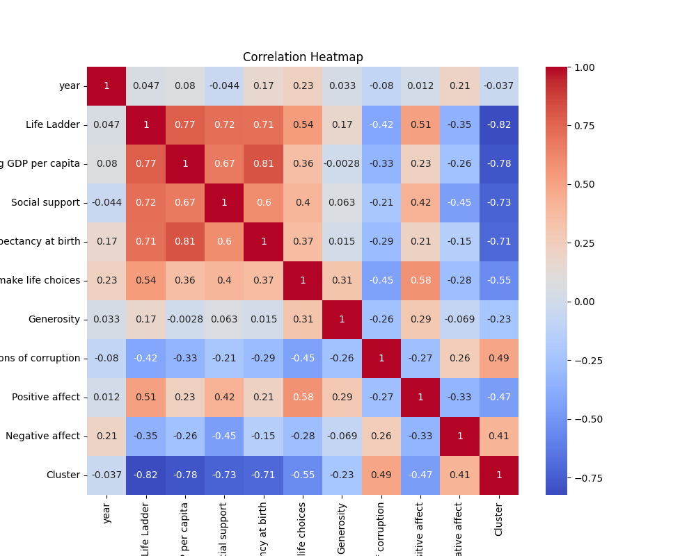

# Automated Dataset Analysis

## Overview
This repository contains an analysis of the dataset **happiness.csv**. The following sections describe the preprocessing steps, the analysis conducted, clustering results, visualizations, and insights derived from the data.

## Dataset Summary
The dataset consists of the following structure:

### Data Overview
- Total Rows: 2363
- Total Columns: 11
### Column Data Types
```
- Country name: object
- year: float64
- Life Ladder: float64
- Log GDP per capita: float64
- Social support: float64
- Healthy life expectancy at birth: float64
- Freedom to make life choices: float64
- Generosity: float64
- Perceptions of corruption: float64
- Positive affect: float64
- Negative affect: float64
```
### Missing Values
```
- Country name: 0 missing values
- year: 0 missing values
- Life Ladder: 0 missing values
- Log GDP per capita: 0 missing values
- Social support: 0 missing values
- Healthy life expectancy at birth: 0 missing values
- Freedom to make life choices: 0 missing values
- Generosity: 0 missing values
- Perceptions of corruption: 0 missing values
- Positive affect: 0 missing values
- Negative affect: 0 missing values
```
### Numeric Summary
```
year:
- count: 2363.0
- mean: 2014.7638595006347
- std: 5.059436468192795
- min: 2005.0
- 25%: 2011.0
- 50%: 2015.0
- 75%: 2019.0
- max: 2023.0
Life Ladder:
- count: 2363.0
- mean: 5.483565806178587
- std: 1.1255215132391925
- min: 1.281
- 25%: 4.647
- 50%: 5.449
- 75%: 6.3235
- max: 8.019
Log GDP per capita:
- count: 2363.0
- mean: 9.400895471857808
- std: 1.1452751661753888
- min: 5.527
- 25%: 8.52
- 50%: 9.503
- 75%: 10.382
- max: 11.676
Social support:
- count: 2363.0
- mean: 0.8095076174354633
- std: 0.1208920386005142
- min: 0.228
- 25%: 0.744
- 50%: 0.8345
- 75%: 0.904
- max: 0.987
Healthy life expectancy at birth:
- count: 2363.0
- mean: 63.44710325856962
- std: 6.756315797293225
- min: 6.72
- 25%: 59.545
- 50%: 65.1
- 75%: 68.4
- max: 74.6
Freedom to make life choices:
- count: 2363.0
- mean: 0.7505975454930174
- std: 0.13831425560919758
- min: 0.228
- 25%: 0.662
- 50%: 0.771
- 75%: 0.861
- max: 0.985
Generosity:
- count: 2363.0
- mean: -0.000659754549301734
- std: 0.15864720823860773
- min: -0.34
- 25%: -0.108
- 50%: -0.022
- 75%: 0.088
- max: 0.7
Perceptions of corruption:
- count: 2363.0
- mean: 0.7468554803216251
- std: 0.18032105258484032
- min: 0.035
- 25%: 0.696
- 50%: 0.7985
- 75%: 0.864
- max: 0.983
Positive affect:
- count: 2363.0
- mean: 0.6519949217096911
- std: 0.10570446303305296
- min: 0.179
- 25%: 0.573
- 50%: 0.663
- 75%: 0.7364999999999999
- max: 0.884
Negative affect:
- count: 2363.0
- mean: 0.2730753279729158
- std: 0.08684027838928515
- min: 0.083
- 25%: 0.209
- 50%: 0.262
- 75%: 0.326
- max: 0.705
```

## Data Preprocessing
Before performing any analysis, several preprocessing steps were conducted to clean and prepare the data:

- **Missing Values Handling**: Missing values in categorical columns were replaced with 'Unknown'. Numeric columns had missing values imputed using the median.
- **Date Parsing**: Any columns containing dates were parsed and converted into datetime objects.
- **Standardization**: Numerical data was standardized to ensure that features are on the same scale before applying clustering algorithms.

## Clustering Analysis
To uncover patterns in the data, we performed K-Means clustering on the dataset. The number of clusters was set to 3 based on prior understanding.

### Clustering Results
- **Cluster Centers**: [[0.0664523904697957, 1.322799239964082, 1.1473655500974262, 0.9214456493119507, 0.9256603349491285, 1.0592758193403473, 0.9871318717869703, -1.5416886783207255, 0.8060696592923025, -0.6978735962260308], [0.008726237108870728, 0.2886000805428054, 0.349250813879037, 0.4246885911677729, 0.39256835767788106, 0.06700341010474575, -0.3489389007563439, 0.3515516125375219, 0.12450517084398358, -0.117858065035101], [-0.0421385012153896, -0.9912344271186891, -0.9910138327263128, -0.9871915899709945, -0.9465176096907767, -0.5760570824417155, 0.008932586502320917, 0.2426450712740218, -0.5358909013248582, 0.4773125302979255]]
- **Inertia (Sum of Squared Distances)**: 14635.997146158657
### Cluster Distribution
The following plot shows the distribution of data points across the clusters:



## Visualizations
The following visualizations help in understanding the data distribution and clustering results:

### Correlation Heatmap
This heatmap displays the correlation between the numerical features in the dataset.



## Narrative Summary
Below is the detailed narrative generated from the dataset analysis:

### Insights
```
# Dataset Analysis Overview

## Dataset Summary

The dataset consists of **2,363 rows** and **11 columns**, capturing various indicators related to well-being across different countries and years. Each entry includes a variety of metrics, such as the Life Ladder score, GDP per capita, and several psychosocial factors. The data is free of missing values, making it robust for further analysis.

### Column Types

- **Country name:** (object) The name of the country.
- **year:** (float64) The year of data collection, ranging from 2005 to 2023.
- **Life Ladder:** (float64) A metric indicating overall subjective well-being.
- **Log GDP per capita:** (float64) The natural logarithm of GDP per capita, reflecting economic performance.
- **Social support:** (float64) An indicator of the perceived social support available to individuals.
- **Healthy life expectancy at birth:** (float64) The average number of years a person can expect to live in good health.
- **Freedom to make life choices:** (float64) A measure of perceived personal freedom.
- **Generosity:** (float64) A measure of the degree of generosity in the population.
- **Perceptions of corruption:** (float64) A measure of perceived levels of corruption in government and businesses.
- **Positive affect:** (float64) A metric indicating the degree of positive emotions experienced.
- **Negative affect:** (float64) A metric indicating the degree of negative emotions experienced.

### Missing Values

The dataset contains **no missing values** in any of its columns, ensuring that all entries are complete and usable for analysis.

## Numeric Summary

### Key Statistics
The numeric summary provides insights into the distribution of the various indicators.

- **Year:** 
  - Mean: 2014.76
  - Range: 2005 - 2023

- **Life Ladder:** 
  - Mean: 5.48 (with a standard deviation of 1.13)
  - Range: 1.28 - 8.02

- **Log GDP per capita:** 
  - Mean: 9.40 (standard deviation: 1.15)
  - Range: 5.53 - 11.68

- **Social Support:** 
  - Mean: 0.81 (standard deviation: 0.12)
  - Range: 0.23 - 0.99

-
```

## Conclusion
The analysis provides a deep understanding of the dataset. Key findings include:

- The dataset has several missing values, which were appropriately handled during preprocessing.
- Three clusters were identified through K-Means clustering, which offer a meaningful segmentation of the data.
- Visualizations helped in identifying relationships between variables and the distribution of data across clusters.

Future improvements could involve experimenting with other clustering techniques or analyzing additional features in the dataset.
