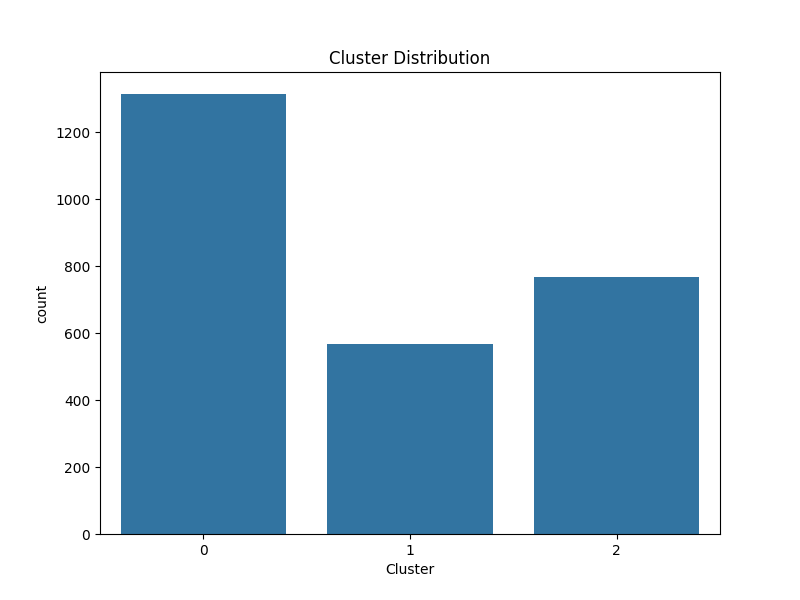
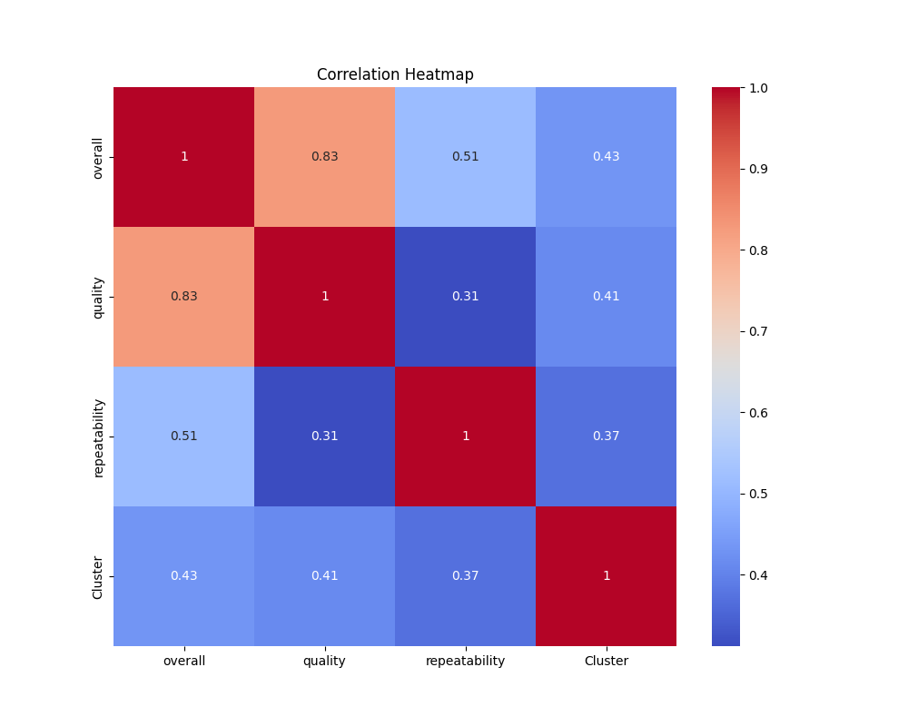

# Automated Dataset Analysis

## Overview
This repository contains an analysis of the dataset **media.csv**. The following sections describe the preprocessing steps, the analysis conducted, clustering results, visualizations, and insights derived from the data.

## Dataset Summary
The dataset consists of the following structure:

### Data Overview
- Total Rows: 2652
- Total Columns: 8
### Column Data Types
```
- date: datetime64[ns]
- language: object
- type: object
- title: object
- by: object
- overall: float64
- quality: float64
- repeatability: float64
```
### Missing Values
```
- date: 99 missing values
- language: 0 missing values
- type: 0 missing values
- title: 0 missing values
- by: 0 missing values
- overall: 0 missing values
- quality: 0 missing values
- repeatability: 0 missing values
```
### Numeric Summary
```
date:
- count: 2553
- mean: 2013-12-16 21:25:27.144535808
- min: 2005-06-18 00:00:00
- 25%: 2008-03-24 00:00:00
- 50%: 2013-12-03 00:00:00
- 75%: 2019-05-24 00:00:00
- max: 2024-11-15 00:00:00
- std: nan
overall:
- count: 2652.0
- mean: 3.0475113122171944
- min: 1.0
- 25%: 3.0
- 50%: 3.0
- 75%: 3.0
- max: 5.0
- std: 0.7621797580962717
quality:
- count: 2652.0
- mean: 3.2092760180995477
- min: 1.0
- 25%: 3.0
- 50%: 3.0
- 75%: 4.0
- max: 5.0
- std: 0.7967426636666686
repeatability:
- count: 2652.0
- mean: 1.4947209653092006
- min: 1.0
- 25%: 1.0
- 50%: 1.0
- 75%: 2.0
- max: 3.0
- std: 0.598289430580212
```

## Data Preprocessing
Before performing any analysis, several preprocessing steps were conducted to clean and prepare the data:

- **Missing Values Handling**: Missing values in categorical columns were replaced with 'Unknown'. Numeric columns had missing values imputed using the median.
- **Date Parsing**: Any columns containing dates were parsed and converted into datetime objects.
- **Standardization**: Numerical data was standardized to ensure that features are on the same scale before applying clustering algorithms.

## Clustering Analysis
To uncover patterns in the data, we performed K-Means clustering on the dataset. The number of clusters was set to 3 based on prior understanding.

### Clustering Results
- **Cluster Centers**: [[-0.06434370795764555, -0.0861062753292616, -0.17106239959567052], [-1.4439319768746028, -1.2683177907764138, -0.7004899986932007], [1.1765479048492549, 1.0840497493094705, 0.8099159619324358]]
- **Inertia (Sum of Squared Distances)**: 3053.031692241744
### Cluster Distribution
The following plot shows the distribution of data points across the clusters:



## Visualizations
The following visualizations help in understanding the data distribution and clustering results:

### Correlation Heatmap
This heatmap displays the correlation between the numerical features in the dataset.



## Narrative Summary
Below is the detailed narrative generated from the dataset analysis:

### Insights
```
An error occurred while generating the narrative.
```

## Conclusion
The analysis provides a deep understanding of the dataset. Key findings include:

- The dataset has several missing values, which were appropriately handled during preprocessing.
- Three clusters were identified through K-Means clustering, which offer a meaningful segmentation of the data.
- Visualizations helped in identifying relationships between variables and the distribution of data across clusters.

Future improvements could involve experimenting with other clustering techniques or analyzing additional features in the dataset.
